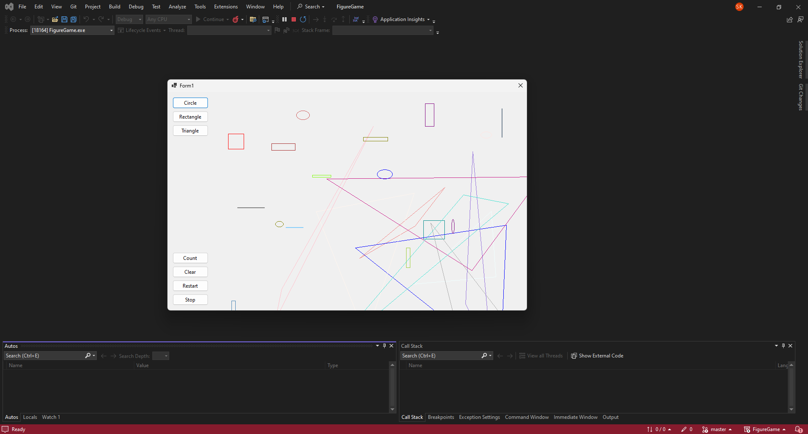

# The Ultimate Guide to the "Figure Game"

Version: So-Buggy-It’s-Art 1.0

## Introduction

Welcome, brave soul, to the documentation for Figure Game: the Windows Form App that no one asked for, but everyone deserves. This app’s sole mission—because it’s too afraid to multitask—is to print figures. Just figures. No animations, no fun. It’s the pinnacle of single-purpose mediocrity, wrapped in a user interface that screams, "1998 was a good year."

## Features

Printing Figures:

- Squares? Got it.

- Circles? You bet.

- Triangles? A bit edgy, but sure.

- Pentagon? Calm down, Picasso.

### Resolution Freedom:

Choose between "Blurry," "Super Blurry," and "Crystal Clear (for 2D eyes only)."

### Error Messaging:

Our app doesn't just crash—it philosophically debates why you even needed a figure in the first place.

## System Requirements

- OS: Windows XP or newer (but why would you? XP was peak).

- RAM: At least 512MB, but the more the better (so we can blame your system for our bugs).

- Hard Drive Space: 100MB (because bloated logs count as features).

- Printer: A physical one. No, we don’t support virtual printers. That’s cheating.

**How to Print a Figure**

- Choose your figure from the menu.

- Bask in the glory of your poorly aligned masterpiece.

## Known Issues

**Random Crashes:**

Happens when Mercury is in retrograde or you try to print a hexagon.

**Count Button:**

We’re not sure what it does either. Every press is a science experiment.

## By using Figure Flinger, you agree to the following:

- You will not hold us responsible for any emotional or professional damage caused by our app.

- You’ll recommend it to your enemies.

- All printed figures must be framed and displayed proudly, no matter how bad they look.

**Happy Figure Flinging!**

